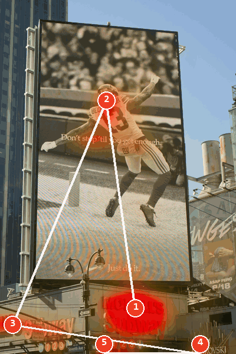
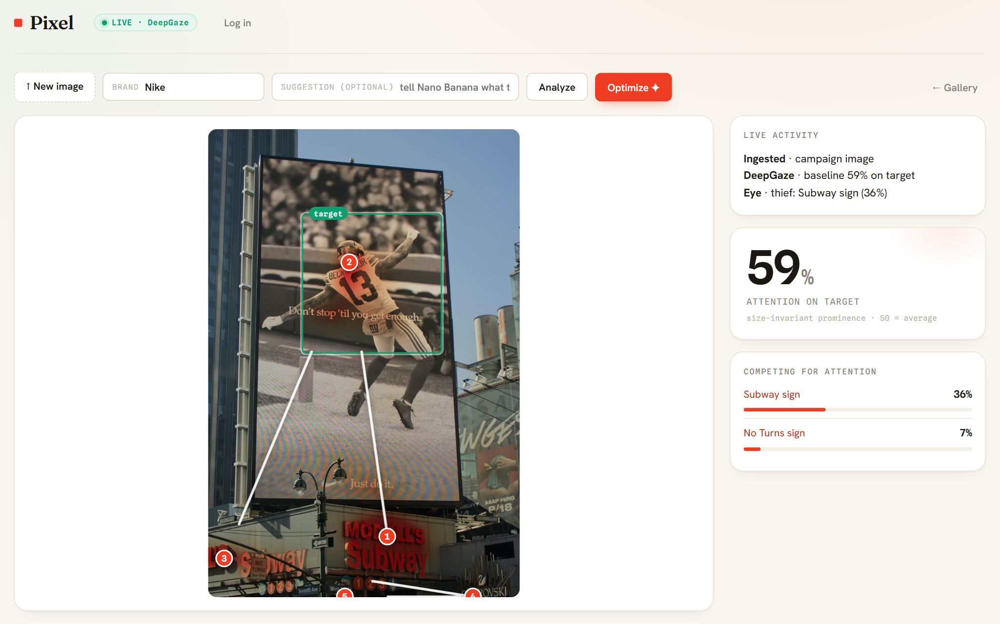
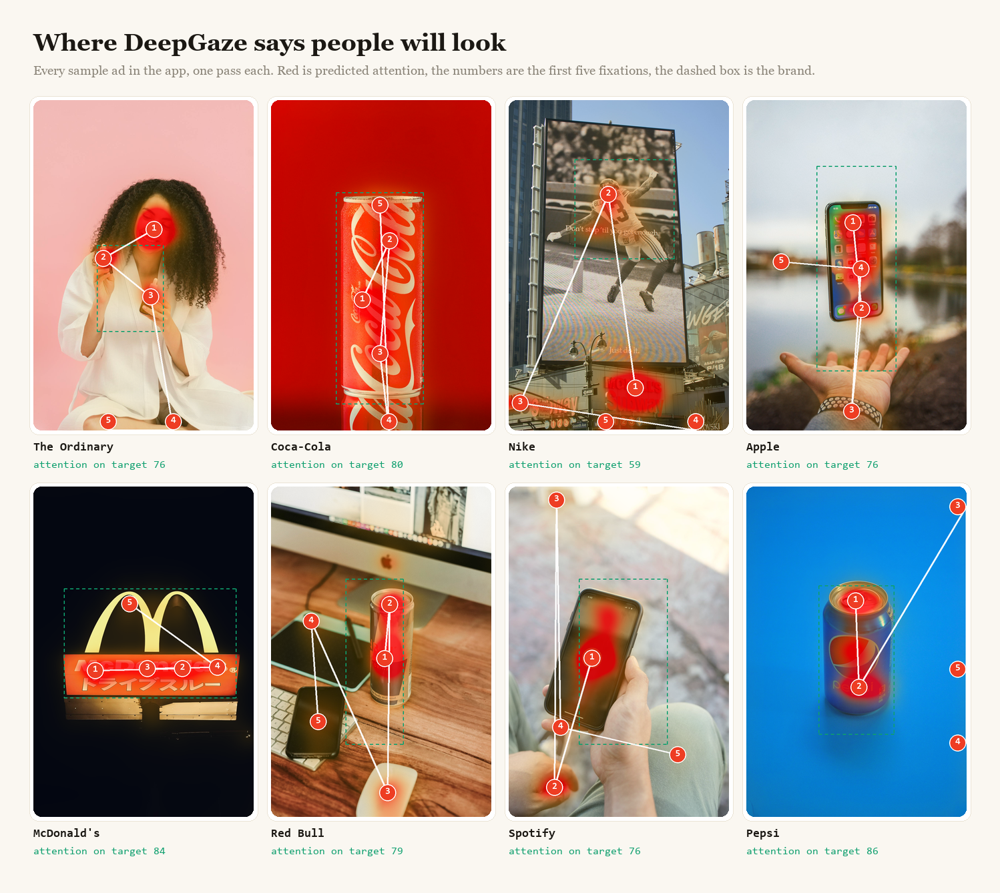
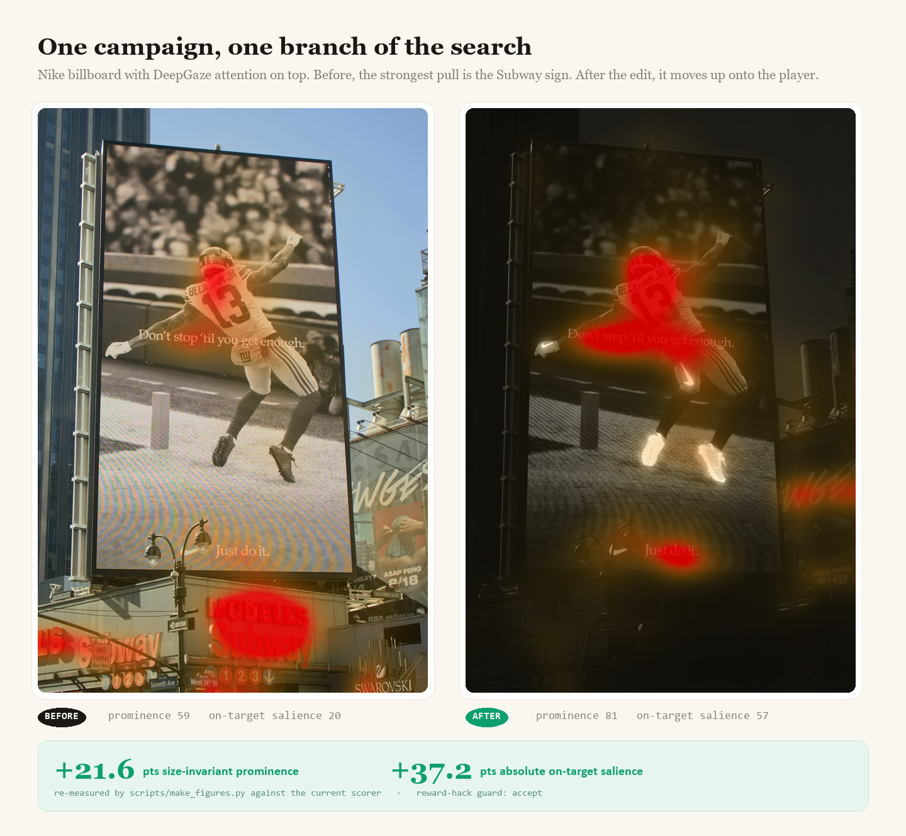
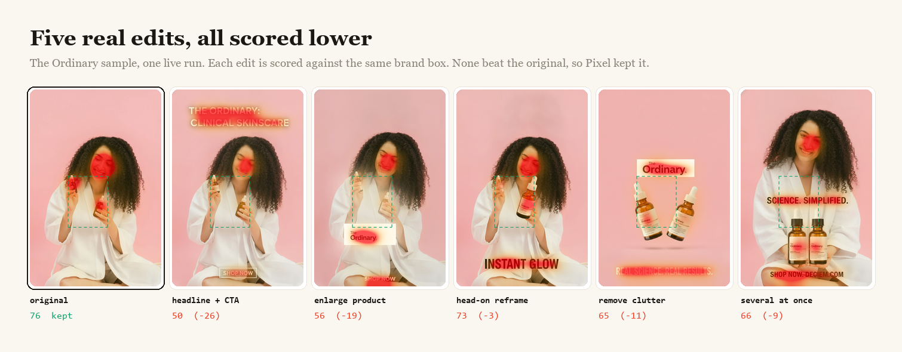
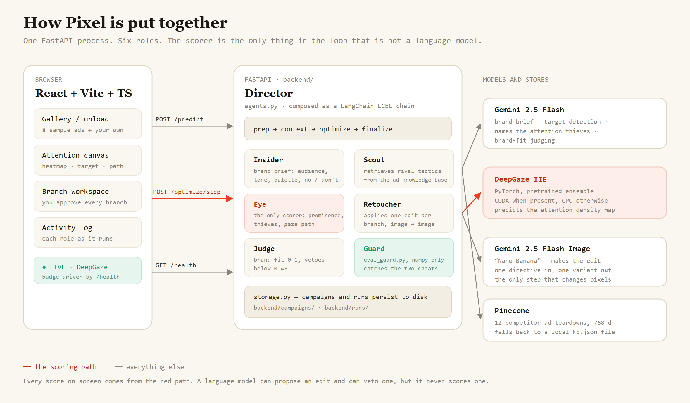

<h1 align="center">Pixel</h1>

<p align="center"><b>See where people will look at your ad before you pay to run it.</b><br>
Pixel runs a gaze model over an ad, finds what is pulling the eye away from the brand, and has a team of AI agents redesign it. Every edit is re-scored by the gaze model, and edits that don't raise the score are thrown out.</p>

<p align="center">
  
</p>

<p align="center">Built in one day at Multimodal Hacks (NY Tech Week, June 6 2026) with <a href="https://github.com/rishis123">Rishi Shah</a>.</p>

## How it works

1. **Look.** [DeepGaze IIE](https://github.com/matthias-k/DeepGaze), a neural saliency model trained on real eye-tracking data, predicts how likely each pixel of the ad is to be looked at.
2. **Score.** Pixel measures how much of that attention lands on the brand (the logo, the product, the call to action) compared with how big the brand is. 50 means the brand gets exactly its fair share for its size. Higher means it pulls more than its size.
3. **Find the thieves.** The strongest spots outside the brand are the things stealing attention. Gemini looks at each one and names it ("Subway sign", "smiling woman's face").
4. **Edit.** Agents propose changes, Gemini's image model ("Nano Banana") makes them, and DeepGaze re-scores every result. A brand-fit judge and a reward-hack guard can veto an edit. You watch each branch land and decide whether to grow another.

<p align="center"></p>

That is the app on the Nike sample. The billboard is the ad, but the first predicted fixation lands on the Subway sign below it, and the area around that sign takes 36% of all the attention in the frame.

## What the gaze model sees

<p align="center"></p>

A few things the model picks up that a person would also notice:

- **Faces win.** On The Ordinary ad, the woman's face gets the first fixation and more than half the attention in the frame. The serum bottles she is selling come second.
- **Text is a magnet.** On McDonald's, the eye walks along the lit nameplate before it touches the arches.
- **Clutter competes.** On Red Bull, the phone and the mouse on the desk each pull a fixation away from the can.
- **Red on red disappears.** The Coca-Cola can scores well, but its heat barely shows against the red background. The model still finds the script logo.

## One edit that worked

<p align="center"></p>

The search on the Nike billboard tried six edits over two rounds. Darkening only the slogan or only the store sign barely helped. Muting everything except the logo and product, then boosting their contrast and sharpness, did a lot: attention on target went from 59 to 81, and the absolute amount of attention on the brand almost tripled. Those numbers are recomputed from the saved images every time the figure is built, by [`scripts/make_figures.py`](scripts/make_figures.py).

## Most edits don't work, and Pixel says so

<p align="center"></p>

This is a live run on The Ordinary ad from September 2026, with every edit saved. Each one looks more like a finished campaign than the original, and each one scored lower. A new headline gives the eye something else to read. Two of the edits moved the bottles, and the brand box does not move with them. So Pixel kept the original and reported a change of zero.

The first version of Pixel could not do this. It measured raw attention inside the brand box, so "make the logo bigger" always won, and it floored every result at the baseline, so the number could only go up. The version here fixes both:

- **The score is size-invariant.** Attention share is divided by the box's share of the frame, so enlarging the target stops being a free win.
- **Losing edits stay visible.** The before and after show the real change, including zero or negative.
- **A guard catches two cheats** ([`backend/eval_guard.py`](backend/eval_guard.py)). If the brand's share of attention went up but the absolute attention on it did not, the edit won by dimming everything else and is rejected. If the edit is too small to see, it is rejected as a likely adversarial trick.
- **The badge tells the truth.** If DeepGaze fails to load and the cheap fallback runs instead, `/health` says so and the app shows DEMO instead of LIVE.

The full list of ways the score can still be gamed, and what is done about each, is in [`docs/EVAL_FLAWS.md`](docs/EVAL_FLAWS.md).

## System design

<p align="center"></p>

A Director runs five specialists as a [LangChain](https://www.langchain.com) pipeline:

| Agent | What it does |
|---|---|
| **Insider** | Writes a brand brief with Gemini: audience, tone, palette, do's and don'ts |
| **Scout** | Pulls rival ad tactics from a [Pinecone](https://www.pinecone.io) index of 12 competitor ad teardowns |
| **Eye** | Runs DeepGaze. The only part of the system that produces a score |
| **Retoucher** | Makes one edit per branch with Gemini 2.5 Flash Image |
| **Judge** | Scores brand fit from 0 to 1 with Gemini and vetoes anything under 0.45 |

A language model can propose an edit and can veto one, but it never scores one. The fixation order drawn on the figures is a fast stand-in for a scanpath model: the highest attention peaks in turn, with each visited peak suppressed before picking the next.

## Run it

```bash
cd backend
python -m venv .venv && .venv\Scripts\activate      # or: source .venv/bin/activate
pip install -r requirements.txt
uvicorn main:app --reload --port 8000
```

```bash
cd frontend
npm install
npm run dev                                         # http://localhost:5173
```

Keys go in git-ignored files: `GEMINI_API_KEY`, `PINECONE_API_KEY` and `PINECONE_INDEX` in `backend/.env`, and `VITE_CLERK_PUBLISHABLE_KEY` in `frontend/.env.local`. Seed the competitor index once with `python backend/pinecone_seed.py`. Without a Gemini key the app still analyzes ads, but edits come back unchanged. DeepGaze runs on the GPU when there is one and on the CPU otherwise.

To rebuild the figures in this README:

```bash
python scripts/make_showcase.py                     # gallery, GIF, every-edit strip
python scripts/make_figures.py                      # Nike before and after
python scripts/capture_run.py the-ordinary "The Ordinary"   # a new live run (needs a Gemini key)
python backend/test_scoring.py && python backend/test_eval_guard.py
```

| Folder | What's in it |
|---|---|
| [`backend/`](backend/) | FastAPI app, DeepGaze runner and score, agents, branch search, reward-hack guard, tests |
| [`frontend/`](frontend/) | Vite, React and TypeScript app, the sample ads, the saved Nike run |
| [`scripts/`](scripts/) | Figure builders and the live-run capture |
| [`results/`](results/) | The Ordinary run: every edit and its scores |
| [`docs/`](docs/) | How the score can be gamed and what stops it |

## Credits

Gaze model: DeepGaze IIE by Linardos, Kümmerer, Press and Bethge ([ICCV 2021](https://arxiv.org/abs/2105.12441)), from [matthias-k/DeepGaze](https://github.com/matthias-k/DeepGaze). Edits, brand briefs, region names and judging by [Google Gemini](https://ai.google.dev). Competitor memory on [Pinecone](https://www.pinecone.io), orchestration with [LangChain](https://www.langchain.com), sign-in by [Clerk](https://clerk.com). Sample ad photos from [Unsplash](https://unsplash.com) and [Pexels](https://www.pexels.com).
